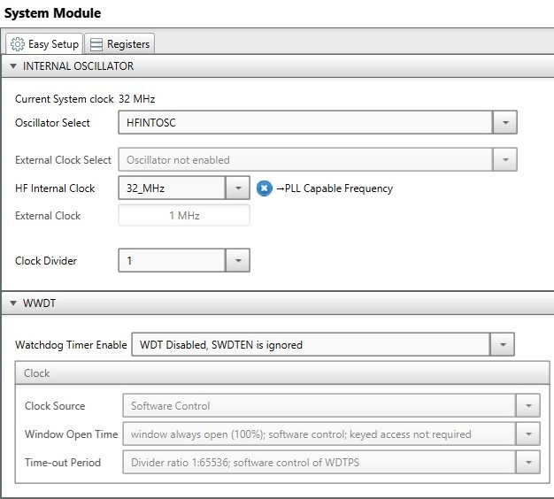
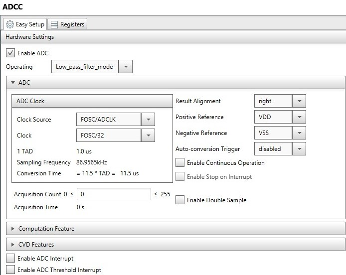
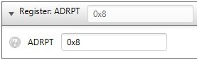
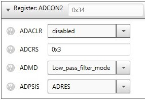
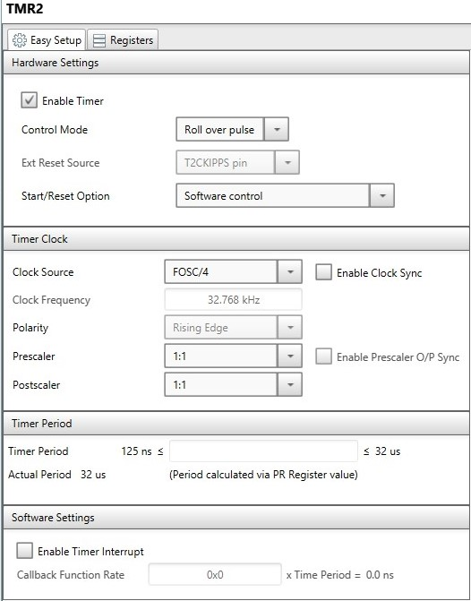
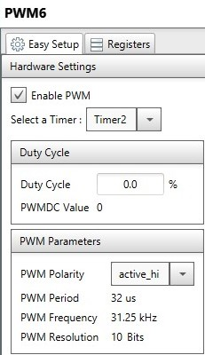
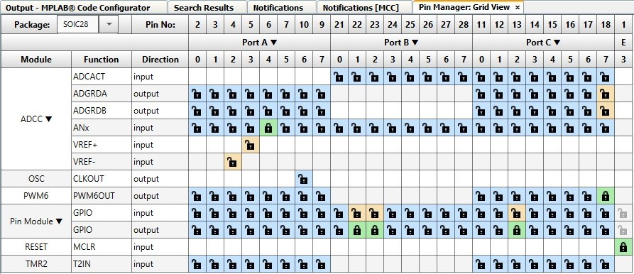
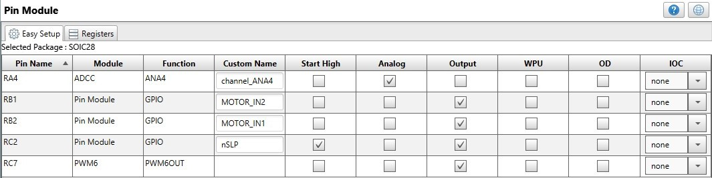

# DC Motor Control using DC Motor 2 Click™

Use the MPLAB® Xpress Evaluation Board and MCC to read the onboard potentiometer using the ADCC and generate a PWM signal to drive a DC motor in both directions.

## Software Used
- MPLAB® X IDE 5.30 or newer [(microchip.com/mplab/mplab-x-ide)](http://www.microchip.com/mplab/mplab-x-ide)
- MPLAB® XC8 2.10 or newer compiler [(microchip.com/mplab/compilers)](http://www.microchip.com/mplab/compilers)
- MPLAB® Code Configurator (MCC) 3.95.0 or newer [(microchip.com/mplab/mplab-code-configurator)](https://www.microchip.com/mplab/mplab-code-configurator)
- MPLAB® Code Configurator PIC10/PIC12/PIC16/PIC18 library v1.79.0 [(microchip.com/mplab/mplab-code-configurator)](https://www.microchip.com/mplab/mplab-code-configurator)
- PIC16F1xxxx DFP 1.2.99 or newer Device Pack

## Hardware Used
- MPLAB® Xpress Evaluation Board [(DM164140)](https://www.microchip.com/Developmenttools/ProductDetails/PartNo/DM164140)
- DC Motor 2 Click [(dc-motor-2-click)](https://www.mikroe.com/dc-motor-2-click)
- Generic DC Motor
- Power supply for the DC motor

## Setup

- Xpress board (with PIC16F18855) is used as it has got Drag-and-Drop Programming.
- A PWM peripheral of the PIC MCU is used for generating the PWM signal for the motor.
- The onboard potentiometer is used to adjust the duty cycle of the PWM, and the direction of rotation.
- The potentiometer is read using the ADCC set in Low Pass Filter mode, in order to reduce the noise.
- DC MOTOR 2 Click board™ from MikroElektronika™ is used for driving the motor in both directions.

- Connect the DC motor to the motor pins of the DC Motor 2 Click Board
- Connect the DC Power Supply to the PGND and VIN pins of the DC Motor 2 Click Board
- Plug the DC Motor 2 ClickBoard into the mikroBUS socket on the MPLAB® Xpress Evaluation Board
- Move the potentiometer to its middle position

### MCC Settings:

This section shows the settings used in the demo/example for various MCU modules configuration. These settings were done using the Microchip Code Configurator (MCC). Open MCC to look at the settings of the modules.

### System Module Settings:

The MCU uses the high frequency internal oscillator (HFINTOSC), and the clock is set to 32 MHz. Watchdog Timer is not used in this demo, so it is disabled.

 

 

### ADCC Settings:

ADCC is used to read the potentiometer. It is configured to operate in Low pass filter mode, with a clock of Fosc/32.

 

 

For the Low pass filter mode, there are 2 more settings that must be configured from the Registers view. They are ADRPT and ADCRS.

 

 

 

With these settings, the filtering will use 8 ADC samples.

### TMR2 Settings:

The TMR2 is used as a clock source for the PWM signal.

 

### PWM6 Settings:

The PWM6 is used to generate the PWM signal for the motor. It uses the TMR2 as clock source. The duty cycle is updated at runtime according to the value read from the potentiometer.

 

### Pin Manager Settings:

The pins are configured as follows:

- ADCC input on RA4, named channel_ANA4
- PWM6 output on RC7
- GPIO output on RB1, named MOTOR_IN2
- GPIO output on RB2, named MOTOR_IN1
- GPIO output on RC2, named nSLP, configured to Start High.

 

 

## Demo:
  
- Rotate the potentiometer to adjust the DC motor speed and direction

